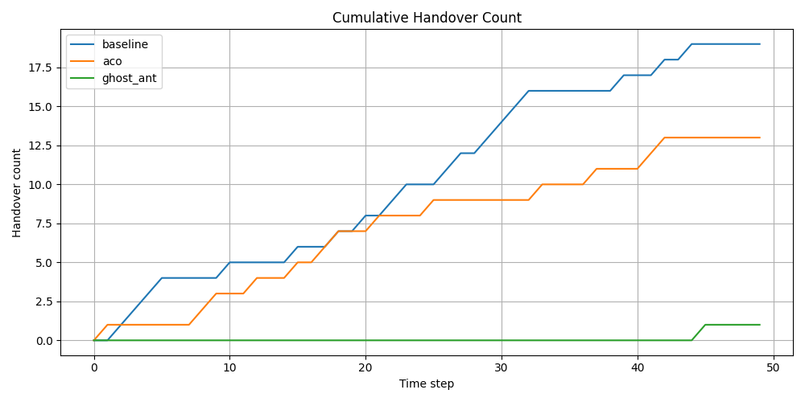
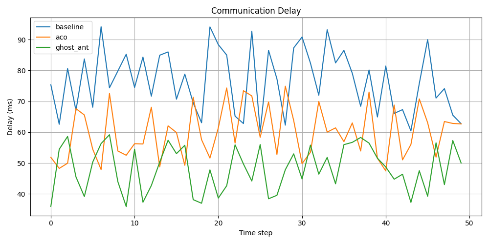
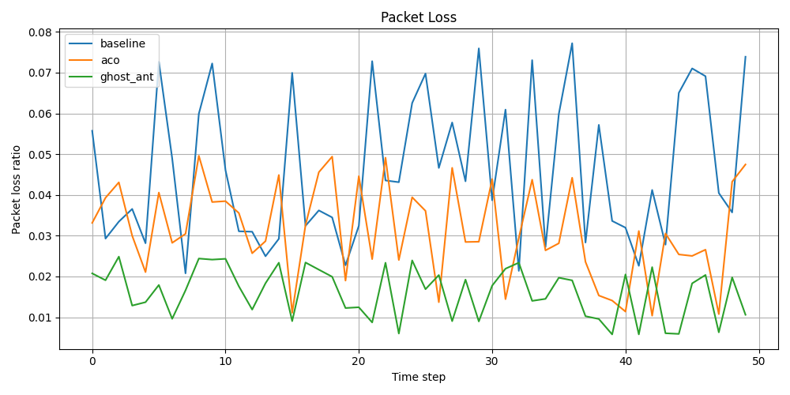
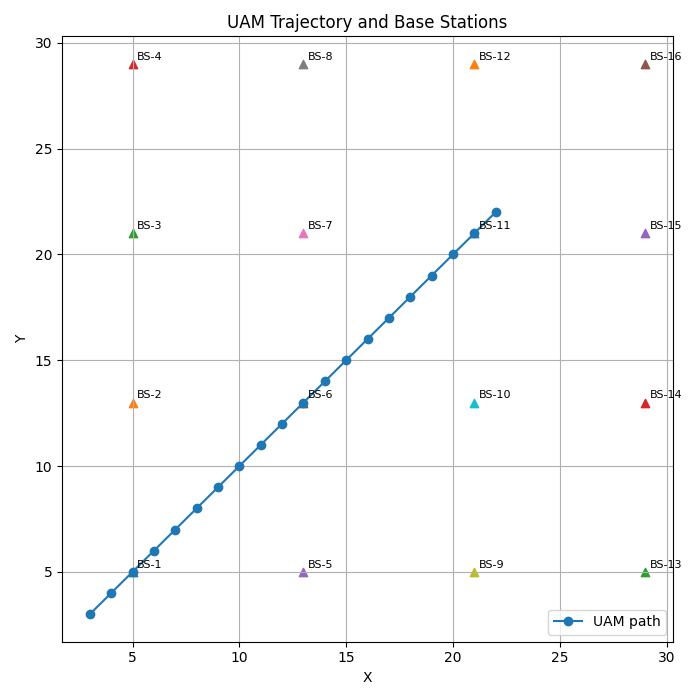
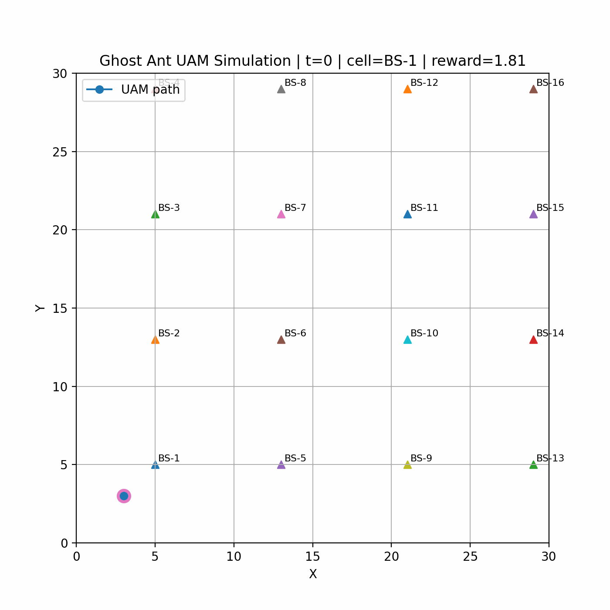

# Ghost Ant Based Adaptive Handover Framework

Adaptive communication optimization for VTOL/UAM environments.

---

## Research Motivation

Communication failure is not just a network problem.

It becomes a mission failure.

---

## Reward Function

Q = α·RSRP + β·LoS − γ·Handover − δ·Delay − ε·PacketLoss

---

## Core Components

- Ghost Ant Lookahead
- 3D Pheromone Map
- Adaptive Handover
- Dynamic Weight
- VTOL/UAM Connectivity
- Packet Loss Optimization

---

## Future Work

- [x] Reward Function
- [x] Initial Prototype
- [ ] Dynamic Weight
- [ ] Ghost Ant Prediction
- [ ] 3D Pheromone Map
- [ ] ROS2 Simulation
- [ ] PX4 Integration
- [ ] Gazebo Evaluation

---

## Repository Structure

```
docs/
research/
simulation/
scripts/
src/
tests/
```

---

## Status

Research Prototype (v0.1)
---

## Simulation Results

### Handover Comparison



### Delay Comparison



### Packet Loss Comparison



---

## Modes

### Baseline
Conventional reactive handover strategy.

### ACO
Ant Colony Optimization based handover decision.

### Ghost Ant
Lookahead-based predictive handover with reduced unnecessary switching.


---

## UAM Trajectory Simulation

### UAM Path and Base Stations



### Simulation Log

The UAM simulation exports step-by-step selected cells, future predicted positions, and reward values.

```text
results/uam_simulation_log.csv

---

## Comparison Summary

The framework compares three strategies:

- Baseline
- ACO
- Ghost Ant

See:

```text
results/comparison_summary.md

---

## UAM Simulation Animation



